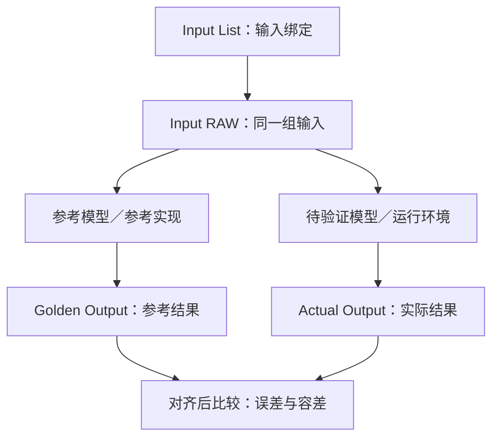

# 05 · 量化 DLC：qairt-quantizer

> **学习位置**：Example2 五阶段中的第五阶段，核心概念学习已完成（2026-08-28）；实际量化与产物验收仍待执行。
>
> **上一阶段**：[04 · ONNX 到 DLC](./04-ONNX到DLC-qairt-converter.md)
>
> **流程总览**：[00 · Example2 主机编译全景](./00-example2主机编译全景.md)
>
> **下一节**：[07 · Context Binary 编译与 HTP 后端](./07-ContextBinary编译与HTP后端.md)。
>
> **本次重点**：已经有 Encoding，为什么代码还传 `input_list`？
>
> **一句话本质**：Encoding 提供已有量化规则，RAW 提供样本数值，Input List 把这些样本绑定到模型输入；当前脚本把中间 DLC 与这份输入清单交给 Quantizer，生成量化 DLC。
>
> **核对日期**：2026-08-28。依据仓库代码及所链接的公开文档整理；没有执行 QAIRT，也没有检查真实 DLC 或校准日志。学习进度不代表编译、精度或设备验收通过。

## 一、介绍：先把三种东西分开

| 对象 | 保存什么 | 不是什么 |
|---|---|---|
| Encoding | 某个张量的位宽、scale、offset 等量化规则 | 不是本次输入的实际数值 |
| Input RAW | 一次模型调用所需的输入张量数值 | 不是权重文件，也不是量化参数文件 |
| `input_list_*.txt` | 输入名称到 RAW 路径的绑定 | 不是 RAW 本身，也不是标注答案 |

例如知道某个张量的 `scale=0.1`，仍不知道这一次输入是 `[0.2, 0.5]` 还是 `[0.4, 0.8]`。反过来，仅有这一组输入值，也不能直接得到模型所有中间张量的量化规则。

因此，两者同时出现不矛盾；但也不能推出「只要量化，就一定必须再次提供样本」。

### 1.1 测试数据相关概念速查

| 概念 | 含义 | 本项目中的例子或用途 |
|---|---|---|
| Calibration Dataset／校准数据集 | 用于观察模型数值分布、确定或优化量化参数的样本集合 | Example1 的 `train_dataloader` 参与 SeqMSE 和激活标定；不等于一份 Input List |
| Test Vector／测试向量 | 一次测试所需的输入及相关参考数据；具体包含什么取决于导出方式 | `fp_0.pkl`、`qt_0.pkl` 保存输入、选定中间结果及输出等 |
| Input RAW／输入数据 | 真正喂给模型的张量字节 | `inputs_embeds.raw`、`attention_mask.raw`、Past K/V 等；普通 RAW 写为 FP32 |
| Input List／输入清单 | 输入名称到 RAW 路径的绑定 | 一组输入包含多个 `名称:=路径`，不包含权重或 Golden 数值 |
| Golden Output／参考输出 | 指定参考模型或参考实现对相应输入产生的结果，用于比较 | `test_golden_outputs_*/Result_0/*.raw`；这里是从 PKL 提取的参考候选 |
| Actual Output／实际输出 | 待验证模型或运行环境对相应输入算出的结果 | 后续运行 QNN 时采集的 logits、New K/V 等；不是 Quantizer 输出的 DLC 文件 |
| Ground Truth／标注真值 | 数据集定义的正确答案或标签 | 用于任务质量评估；与参考模型生成的 Golden 是不同概念 |
| Comparison Report／对拍报告 | 实际输出与参考输出之间的数值比较结果 | 仓库 `check_output()` 可计算 SQNR、MSE、CosSim；有这个工具不代表已经执行或通过 |

**Golden 和 Actual 描述数据的角色，RAW 和 PKL 描述保存方式。** 输入、Golden、Actual 都可能保存为 `.raw`，不能用扩展名区分用途。RAW 自身不记录 Shape、dtype 和布局，读取时必须与接口约定一致。

### 1.2 模型部署相关文件速查

| 文件或产物 | 含义 |
|---|---|
| ONNX | 模型计算图、张量信息，以及内嵌参数或外部参数引用 |
| External Data | 从 ONNX 主文件分离保存的张量数据，通常包含大权重；按 ONNX 内的引用加载，不能与 Input RAW 混淆 |
| Encoding | 参数及激活的量化设置，不是样本数据，也不是参考输出 |
| 中间 DLC | Converter 交给 Quantizer 的 Qualcomm 模型容器；可以已携带量化信息 |
| Quantized DLC | 本项目经过 Quantizer 处理的模型产物；与运行一次模型产生的 Actual Output 不同 |
| Context Binary | 为目标后端生成的序列化上下文，供后续部署加载；本项目该生成阶段尚未进入活动主流程 |

关于 External Data 的保存与引用，见 [ONNX 官方说明](https://onnx.ai/onnx/repo-docs/ExternalData.html)。DLC、量化与 Context 的阶段关系，见 [AIMET 部署说明](https://qualcomm.github.io/aimet-pages/releases/2.13.0/tutorials/on_target_inference.html#qualcomm-ai-engine-direct-sdk)。

### 1.3 Golden 与 Actual 怎样配合

下面是数值验证的一般关系，不表示当前编译脚本已经自动完成这些步骤：



例如参考结果为 `[1.20, -0.50]`，实际结果为 `[1.19, -0.49]`，逐元素绝对差都是 `0.01`。这只是示意；是否通过要由对应张量与任务的容差要求判断，不能默认逐字节相同，也不能只凭一组数值接近就认定整体精度合格。

对比前要确认输入与 KV 状态、AR／Split、输出名称、Shape、布局和数值表示一致。若读取的是整数原生输出，应按相应 Encoding 对齐到可比较的数值，而不能直接当 FP32 RAW 读取。

### 1.4 本项目 Golden 的来源与边界

- `fp_0.pkl` 是同一仿真模型临时关闭量化器后导出的参考数据；`qt_0.pkl` 是开启量化模拟时导出的数据。`fp` 不等于未经适配的原始预训练模型，`qt` 也不等于所有保存数据都是整数。见 [test_vectors.py](../../../example1/llm_utils/test_vectors.py) 第 258～284 行。
- 当前 Split 从经过 AR 形状适配的 `qt_0.pkl` 同时提取输入和输出，并写出 Input RAW、Input List、Golden RAW。它没有在这一步重新运行目标 AR 的 Split 图计算 Golden。见 [utils.py](../../../example2/G2G/split_onnx_utils/utils.py) 第 908～933 行。
- 缺失张量补 Dummy 的分支也可能作用于输出。因此这些文件应视为参考候选，先确认输入对应关系、AR 语义和生成来源，再用作数值基准；不能断言全部有效，也不能未检查就断言全部错误。
- 仓库有 `check_output()`，但当前 Quantizer 主流程没有调用它。它按 FP32 RAW 读取参考与实际结果，再计算指标；输出接口或 dtype 改变时不能直接套用。

## 二、原理：已有规则与数据驱动处理如何配合

### 2.1 Encoding 在哪里交给工具

本项目先在 `thread_convert()` 中通过 `--quantization_overrides` 传入 SHA Encoding，再把生成的中间 DLC 交给 `thread_genlib()`。

后者的 Quantizer 命令没有再次传 `.encodings` 文件。这里依赖前一阶段完成量化信息的交接，不是让 Quantizer 从 RAW 中猜出此前 AIMET 的全部设置。

### 2.2 为什么带样本仍然可能有用

先区分两个问题：

1. **某个张量已经有可用 Encoding**：有了量化规则，应用该规则不需要重新从样本中推导同一套规则。
2. **最终图的某些张量缺少可用 Encoding**：如果选择数据标定路径，就需要实际输入，让图产生相应的中间数值，才能进行数据驱动的范围统计。

后者可能与导出覆盖范围、图转换后的张量映射等有关；这里是在解释可能的需求，**不表示已经发现本项目某个张量确实缺失 Encoding**。

公开 CLI 文档说明，用户提供的 overrides 用于覆盖一般生成的量化规则，并另设忽略 overrides 的选项。当前命令没有启用该忽略选项。因此，不应把「传了 Input List」理解为「丢弃 AIMET 的 Encoding，重新标定所有张量」。具体接受、传播或补齐了哪些规则，仍需结合所用 SDK 的日志与产物检查。[QAIRT CLI 参数说明](https://docs.radxa.com/en/dragon/q6a/app-dev/npu-dev/qairt-tools#qairt-quantizer)

### 2.3 Input List 并非所有用法都必需

AIMET 官方部署示例给出一种不传 Input List 的方式：使用已有 Encoding，并通过 `--float_fallback` 为缺少量化参数的部分保留浮点处理。这说明无样本路径存在；它与本项目带 Input List 的调用不是同一个选择。[AIMET 部署指南](https://qualcomm.github.io/aimet-pages/releases/2.13.0/tutorials/on_target_inference.html#quantization)

不同 SDK 版本可能使用不同选项名称，例如公开 CLI 文档中的 `--enable_float_fallback`。不要直接删除本项目的 `--input_list`，也不要把其他版本的参数机械复制进来；应先核对当前 SDK 帮助、Encoding 覆盖和目标后端支持。

### 2.4 为什么这不等于重新训练或精度验收

当前调用没有运行反向传播或 AIMET SeqMSE，也没有传入标签、Golden Output 或 PPL 评估命令。

「为量化提供前向输入」和「把量化输出与参考输出比较」是不同的工作。后者仍需单独安排，不能用 Quantizer 打印 `done` 代替。

## 三、官方 Qwen2／Qwen2.5 的做法

本节不涉及修改 Qwen 模型定义。这是导出模型接入 Qualcomm 部署工具链时的数据准备与量化处理。

应把原始模型计算、AIMET 的量化设计、QAIRT 的部署处理分开理解；`input_list` 是当前工具调用的数据入口，不是 Qwen 注意力结构的一部分。

## 四、本项目的做法

### 4.1 当前命令：先看输入和输出

入口是 [qnn_compile_deploy.py](../../../example2/host_linux/qnn_compile_deploy.py) 第 245 行的 `thread_genlib()`；实际调用位于第 258～265 行。

以下是参数示意，不是可以直接复制运行的命令：

```text
qairt-quantizer
  --input_dlc <split_work_dir>/converted_model/<name>.dlc
  --input_list <model_artifact>/input_list_<name>.txt
  --output_dlc <split_work_dir>/compiled_model/<name>_quantized.dlc
  --act_bitwidth 16
  --bias_bitwidth 32
  --keep_weights_quantized
```

这里的 `<model_artifact>` 是某个 AR 的产物目录，`<split_work_dir>` 是它下面的分片目录。当前配置为 AR1／AR128、`num_splits=1`。

| 参数 | 在这里的作用 |
|---|---|
| `--input_dlc` | 读取上一阶段生成的中间 DLC |
| `--input_list` | 找到该 AR、该分片的输入样本清单 |
| `--output_dlc` | 指定量化 DLC 的输出位置 |

与 Converter 的区别是：这一阶段显式提供了样本入口。目录叫 `compiled_model`，也不代表已经生成 HTP Context Binary。

### 4.2 一份 Input List 怎么读

在 [utils.py](../../../example2/G2G/split_onnx_utils/utils.py) 第 924～929 行，代码为每个输入写入 `张量名:=RAW路径`，同一组的多个输入用空格连接。

下面仅示意前两个输入；`/example/` 是示意目录，真实一组还需要其余模型输入：

```text
inputs_embeds:=/example/test_inputs/0/inputs_embeds.raw attention_mask:=/example/test_inputs/0/attention_mask.raw
```

本项目 LLM 分支的输入包括 `inputs_embeds`、`attention_mask`、RoPE 的 cos/sin，以及逐层 Past K/V。这里喂的是已经准备好的张量，不是让 Quantizer 读取原始图片或执行文本分词。

当前主脚本传给 Split 的 `output_dir` 为绝对路径，列表中的 RAW 路径也是绝对路径。移动产物目录以后必须检查这些路径；不能仅凭工作目录中有软链接就认定所有路径都有效。

### 4.3 RAW 从哪里来：与 AIMET 校准集区分开

这几步在代码中承担不同任务：

| 环节 | 当前代码选择 |
|---|---|
| AIMET `compute_encodings()` | 使用 `train_dataloader`；配置最多处理 20 个 batch |
| 导出测试向量 | `generate_test_vectors(..., num_batches=1)` |
| AR 适配 | 调整既有测试向量的形状，配合 AR1／AR128 图 |
| Split 读取测试向量 | 选择 `qt`，文件生成器写死 `range(1)`，只读取 `qt_0.pkl` |
| Split 写输入文件 | 每个输入一个 RAW，再把路径写入 Input List |

对应位置：

- [example1/config.yaml](../../../example1/config.yaml) 第 62 行：校准 batch 配置。
- [example1/llm_quant.py](../../../example1/llm_quant.py) 第 560～568、585 行：激活标定与测试向量导出。
- [change_hardcoding.py](../../../example2/G2G/change_hardcoding.py) 第 203 行附近：测试向量形状适配。
- [utils.py](../../../example2/G2G/split_onnx_utils/utils.py) 第 300、908、924～933 行：读取一份 `qt` 数据并生成测试资产。

所以，**这里不是把 AIMET 的 20 个 batch 原样再校准一遍**。按当前代码准备的是一组测试输入；不能据此声称它足以对所有缺失 Encoding 做有代表性的重新标定。

读取器在部分张量缺失时还存在补 Dummy 的分支（`utils.py` 第 330～336 行）。实际运行应检查相关日志，不能把每个 RAW 都假定为完整、真实的模型采样结果。

### 4.4 `qt` 输入为什么仍是 FP32 RAW

`qt` 表示测试向量的来源，不决定文件里的存储 dtype。

`utils.py` 第 116 行明确执行：

```python
nptensor.astype(np.float32).tofile(filename)
```

因此，Input List 指向的普通 `.raw` 是 FP32 字节。如果原数据不是 FP32，代码还会另存带 dtype 后缀的文件，但列表指向的是普通 `.raw`。

RAW 没有 Shape 或 dtype 文件头；必须按与模型接口匹配的方式读取。**样本文件是 FP32，不等于量化 DLC 的所有端口和内部计算都是 FP32。** 最终接口类型应检查真实 DLC。

### 4.5 其余参数先记住边界

当前调用指定 `--act_bitwidth 16`、`--bias_bitwidth 32`，没有显式指定 `--weights_bitwidth`。上游默认 W4，且存在混合精度规则；不能仅从这些命令参数推断每个张量最终的位宽。

`--keep_weights_quantized` 的用途是允许算子输出为浮点时，权重仍保持量化形式；它不表示所有 Encoding 都被锁定，也不证明所有权重都是 INT4。[参数说明](https://docs.radxa.com/en/dragon/q6a/app-dev/npu-dev/qairt-tools#qairt-quantizer)

### 4.6 后续实际运行时需要检查什么

以下是待做事项，本次没有执行：

- [ ] 脚本能解析、SDK 版本与 Linux 主机环境匹配。主脚本第 178 行的既有残缺文本尚未修复。
- [ ] DLC、Input List、RAW 对应同一 AR／Split，所有输入名、路径和字节数匹配。
- [ ] 检查 Dummy 输入告警和样本代表性。
- [ ] 检查真正的进程退出码，排除旧 DLC 和无条件 `done` 日志。
- [ ] 检查已有 Encoding 是否接受、哪些规则被补齐，以及真实输出 dtype／位宽。
- [ ] 单独做数值对拍和任务精度评估，再进入 Context Binary 编译。

若以后增加测试向量数量，还需先修正 `utils.py` 第 929 行的列表写法：当前每轮写入没有追加换行。现有单组输入不会暴露多组粘连问题，但不能只把 `range(1)` 改大就认定多样本流程可用。本次仅记录，没有修改运行代码。

## 五、本次自测与下一步

1. **Encoding 能替代 RAW 吗？** 不能替代一次前向的实际输入；但已有规则可能支持不使用样本的特定量化路径。
2. **Input List 里放的是 scale 吗？** 不是，它保存输入张量与 RAW 文件的绑定。
3. **传 Input List 就会重新计算全部 Encoding 吗？** 不能这样推断；要看 overrides 的接受情况及所选工具路径。
4. **当前样本等于完整 AIMET 校准集吗？** 不等于，当前 Split 只读取 `qt_0.pkl`。
5. **Golden Output 在本命令中用来训练或对拍吗？** 没有传给 Quantizer，精度验证仍是独立工作。

核心概念部分可以收尾，下一节进入 Context Binary。具体位宽覆盖、SDK 运行及量化产物验收仍需在实操时单独完成，不能据此记为已通过。

最后记住：模型文件保存静态参数与激活的量化规则；每次推理产生的激活数值放在运行内存，不写回 DLC。当前使用预先确定的激活 Encoding，「激活数值随输入变化」不等于「每次推理重新标定量化参数」。

## 六、总结

**Encoding 是已有规则，RAW 是样本数值，Input List 是输入绑定。当前项目采用带一组 FP32 测试输入的 Quantizer 调用；这既不等于重新标定全部规则，也不等于完成精度验收。**
